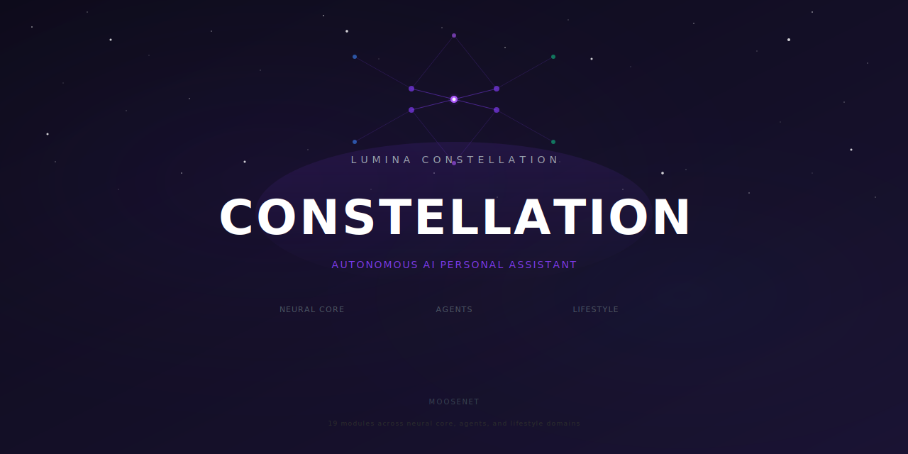
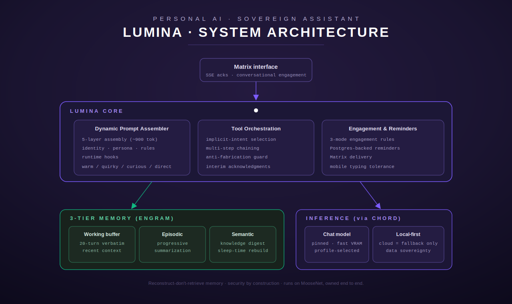

# Lumina

**A sovereign, local-first personal AI with persistent memory and a stable persona.**

  <a href="#overview">Overview</a> •
  <a href="#architecture">Architecture</a> •
  <a href="#components">Components</a> •
  <a href="#repository-layout">Repository Layout</a> •
  <a href="#inference-de-bloating">Inference De-Bloating</a> •
  <a href="#citations--credits">Citations & Credits</a>

---

## Overview

Lumina is the umbrella project for the **Lumina constellation** — a self-hosted, personality-first personal AI that runs end-to-end on owned hardware (MooseNet). Unlike generic chatbots that forget you after every session, Lumina maintains a persistent understanding of who you are — preferences, communication style, schedule, and history — behind a single stable persona.

Three principles define the system:

- **Local-first, cloud-as-fallback.** Inference runs on local models served through [Chord](#inference-via-chord); cloud AI is reserved for the small fraction of work that genuinely needs it. Data sovereignty by default.
- **Reconstruct, don't retrieve.** Memory is a three-tier structure (working buffer, episodic, semantic) that is summarized and rebuilt rather than naively recalled.
- **Inference de-bloating.** Python and templates handle ~90% of operations at zero cost; local models cover ~8%; cloud reasoning is the ~2% remainder. Routine operation targets well under a dollar a day.

This repository is the project/umbrella repo: it holds the architecture, specs, agent definitions, and the source trees for the constellation's components — the Lumina core agent, the Chord inference manager, the Terminus tool hub, the Engram memory system, and the agent fleet.

## Architecture

The diagram shows how a single request flows through the system:

- **Matrix interface** — the conversational front door. Lumina delivers SSE acknowledgments and conversational engagement over Matrix, with tolerance for mobile typing.
- **Lumina Core** — the orchestrator, built from three cooperating subsystems:
  - **Dynamic Prompt Assembler** — assembles the prompt from five layers (~900 tokens): identity, persona, rules, and runtime hooks — producing a voice that is warm, quirky, curious, and direct.
  - **Tool Orchestration** — implicit-intent tool selection, multi-step chaining, an anti-fabrication guard, and interim acknowledgments so the user sees progress.
  - **Engagement & Reminders** — three-mode engagement rules, Postgres-backed reminders, and Matrix delivery.
- **3-Tier Memory (Engram)** — the persistence layer:
  - **Working buffer** — 20-turn verbatim recent context.
  - **Episodic** — progressive summarization of past interactions.
  - **Semantic** — a knowledge digest rebuilt during sleep-time.
- **Inference (via Chord)** — model serving and routing. A pinned, fast-VRAM **chat model** is selected per serving profile, with a **local-first** policy where cloud is a fallback only — preserving data sovereignty.

In short: *reconstruct-don't-retrieve memory, security by construction, runs on MooseNet, owned end to end.*

## Components

| Component | Role |
|-----------|------|
| **Lumina Core** | Personality-first orchestrator: dynamic prompt assembly, tool orchestration, engagement & reminders. |
| **Engram** | Three-tier memory system — working buffer, episodic summarization, semantic knowledge digest. |
| **Chord** | Inference manager — model serving, profile-selected chat model, VRAM-aware residency, local-first routing. |
| **Terminus** | MCP tool hub — tool modules served over FastMCP for the core and fleet. |
| **Fleet** | Specialized agents (briefings, ops, dev loops, research, work queue, cost governance, resilience) delegated to by the core. |

Each fleet agent is defined by a single `.agent.yaml` file. Adding an agent is a matter of dropping one file and starting its process — no code changes required.

## Repository Layout

| Directory | Contents |
|-----------|----------|
| [terminus/](terminus/) | MCP tool hub — tool modules and the FastMCP server. |
| [fleet/](fleet/) | Agent processes — Axon, Vigil, Sentinel, Vector, Seer, Cortex, Myelin, Dura, Soma, and shared libraries. |
| [agents/](agents/) | Agent definitions (`.agent.yaml`). |
| [engram/](engram/) | Knowledge base, journals, and behavioral patterns (memory data). |
| [deploy/](deploy/) | Docker Compose deployment, Dockerfiles, reverse-proxy config. |
| [docs/](docs/) | Built-in help system, module docs, and guides. |
| [specs/](specs/) | System design specifications and PRDs. |
| [skills/](skills/) | Agent Skills in the [agentskills.io](https://agentskills.io) format, auto-discovered at startup. |

## Inference De-Bloating

Before every function: *can Python handle this?* If yes, no LLM. *Can a local model?* If yes, no cloud. Cloud AI only for genuine reasoning.

| Tier | Share | Used for |
|------|-------|----------|
| **Python + templates** ($0) | ~90% | API calls, math, SQL, templates, cron, threshold checks |
| **Local models** ($0) | ~8% | Parsing, classification |
| **Cloud Sonnet / Haiku** | ~2% | Research, synthesis, reasoning |
| **Cloud Opus** | <0.1% | Architecture, security audits |

Most "AI tasks" don't need AI. A Python script checking disk usage is faster, cheaper, and more reliable than asking an LLM to do it. Threshold alerts are comparisons, not inference calls. The system only reaches for AI when it genuinely needs to think — and prefers local inference (via Chord) before any cloud call.

## Runtime & Frameworks

Lumina runs on [IronClaw](https://github.com/nearai/ironclaw), a Rust-based, security-first agent runtime focused on privacy and data sovereignty — WASM sandbox isolation, host-boundary credential injection, and endpoint allowlisting.

| Project | Role in Lumina | Source |
|---------|---------------|--------|
| **IronClaw** | Agent runtime — WASM sandboxing, credential isolation, endpoint allowlisting | [nearai/ironclaw](https://github.com/nearai/ironclaw) |
| **FastMCP** | MCP server framework for Terminus | [jlowin/fastmcp](https://github.com/jlowin/fastmcp) |
| **LiteLLM** | Unified LLM proxy (100+ providers) | [BerriAI/litellm](https://github.com/BerriAI/litellm) |
| **Ollama** | Local model serving (under Chord) | [ollama/ollama](https://github.com/ollama/ollama) |

## Citations & Credits

Lumina builds on ideas and tools from the broader AI agent ecosystem.

### Architectural Influences

**Ralph Loop Pattern** — Geoffrey Huntley. Autonomous agent loop where a coding agent runs repeatedly against a spec until complete, with memory persisting via git history.
- [ghuntley.com/loop](https://ghuntley.com/loop/) · [snarktank/ralph](https://github.com/snarktank/ralph)

**NPCSH** — NPC Worldwide. Composable multi-agent shell with portable agent definitions, team orchestration, and knowledge graphs. Inspired Lumina's `.agent.yaml` format, conversation review, help system, and Docker deployment.
- [NPC-Worldwide/npcsh](https://github.com/NPC-Worldwide/npcsh) · [npc-shell.readthedocs.io](https://npc-shell.readthedocs.io/)

**A-MEM / Agentic Memory** — Xu, W. et al. (2025), NeurIPS. Zettelkasten-inspired memory with dynamic indexing, linking, and evolution. Influenced Engram's interconnected, reconstruct-don't-retrieve design.
- [arxiv.org/abs/2502.12110](https://arxiv.org/abs/2502.12110)

### Self-Hosted Backends

| Project | Role | Source |
|---------|------|--------|
| **Plane CE** | Work queue | [makeplane/plane](https://github.com/makeplane/plane) |
| **Tuwunel** | Matrix communication | [matrix-construct/tuwunel](https://github.com/matrix-construct/tuwunel) |
| **SearXNG** | Research | [searxng/searxng](https://github.com/searxng/searxng) |

## Contributors

- **Peter Boose** ([@LeMajesticMoose](https://github.com/LeMajesticMoose)) — Creator, architect, and product lead. Designed and directed the entire system via voice transcription and AI-assisted development.
- **Claude** ([Anthropic](https://anthropic.com)) — Co-developer. Specifications, implementation, autonomous build sessions, and infrastructure debugging via Claude Code.

## Disclaimer

Lumina is self-hosted software that integrates with services managing sensitive personal data. **You are solely responsible for securing your deployment.** The software is provided "as is" under the MIT License, without warranty of any kind. Self-hosted deployments require proper network isolation, firewall configuration, and credential management. Store all API keys in a secrets manager — never in code or config. AI outputs are not professional advice, and AI agents can hallucinate or take unintended actions; human review of agent-initiated changes is strongly recommended. Use at your own risk.

## License

MIT License. See [LICENSE](LICENSE) for details.

Copyright (c) 2026 Peter Boose

---

  <em>Sovereign · Local-first · Personality-first · Powered by inference de-bloating</em>

