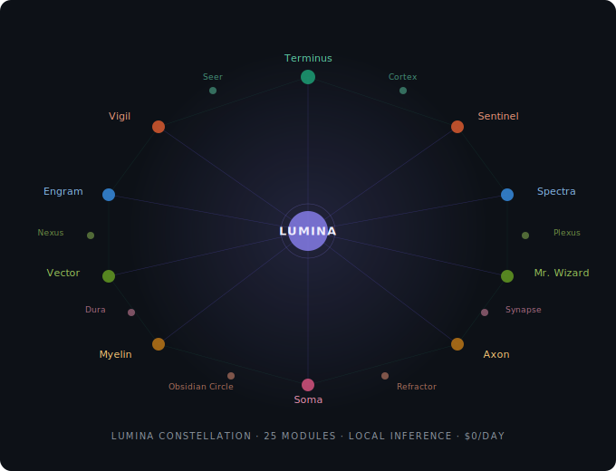

<h1 align="center">✦ Lumina Constellation ✦</h1>

<p align="center">
  <em>Cloud AI charges you per thought. Lumina thinks for free.</em>
</p>

<p align="center">
  
</p>

<p align="center">
  25 modules · Local inference · Your data never leaves your house<br>
  Built by a non-coder directing AI through voice — no IDE, no CS degree required.
</p>

<p align="center">
  <a href="#what-your-morning-looks-like-with-lumina">Morning briefing</a> ·
  <a href="#the-constellation">Modules</a> ·
  <a href="#quick-start">Quick start</a> ·
  <a href="#the-economics">Economics</a> ·
  <a href="docs/architecture.md">Architecture</a> ·
  <a href="CITATIONS.md">Credits</a>
</p>

---

### What your morning looks like with Lumina

```
☀️  Good morning. Tuesday briefing:

Traffic  ·  Normal. Leave by 7:45.
Weather  ·  68°F, clear through 5 PM. No jacket.
Calendar ·  2 meetings (10 AM standup, 2 PM vendor call)
Home     ·  All systems nominal. Sentinel ran 20 checks, 0 alerts.
Budget   ·  $47 under weekly target. Groceries delivery Thursday.
News     ·  Framework Desktop shipping notice arrived.
            NVIDIA announced DLSS 5. SF Giants won 4-2.

Spectra  ·  Captured 3 dashboard screenshots for your review.
Engram   ·  12 new facts stored yesterday. 391 total.
Cost     ·  $0.00 — all local inference.
```

This isn't a demo. This is a real briefing from a running instance. Vigil compiles it at 7 AM from live data — weather, calendar via CalDAV, traffic via TomTom, news via NewsAPI, infrastructure health via Sentinel, budget via Actual Budget — and delivers it to your phone via Matrix. Every line comes from a different module. Total inference cost: zero.

---

### What is Lumina?

Lumina Constellation is a **self-hosted, personality-first AI personal assistant** for individuals and households. She runs on your hardware, learns your routines, manages your infrastructure, tracks your budget, briefs you every morning, and does it all without sending a single token to the cloud.

She's not a chatbot. She's an orchestrator — with opinions, memory, and a daily schedule.

---

### The constellation

| Layer | Modules | What they do |
|-------|---------|-------------|
| **Brain** | [Engram](engram/) · [Obsidian Circle](fleet/obsidian_circle/) · [Mr. Wizard](docs/modules.md#mr-wizard) · [Cortex](fleet/cortex/) | Memory, multi-model reasoning council, deep analysis, code intelligence |
| **Nervous system** | [Axon](fleet/axon/) · [Myelin](fleet/myelin/) · [Synapse](fleet/synapse/) · [Refractor](terminus/) | Work execution, cost governance, notifications, smart routing |
| **Senses** | [Spectra](fleet/spectra/) · [Seer](fleet/seer/) · [Vigil](fleet/vigil/) · [Sentinel](fleet/sentinel/) | Browser automation, web research, daily briefings, monitoring |
| **Body** | [Soma](fleet/soma/) · [Nexus](fleet/nexus/) · [Plexus](docs/modules.md#plexus) · [Terminus](terminus/) · [Dura](fleet/dura/) | Dashboard, inbox, project management, MCP hub, backup |
| **Life** | [Vector](fleet/vector/) · [Meridian](fleet/meridian/) · [Odyssey](docs/modules.md#odyssey) · [Vitals](docs/modules.md#vitals) · [Hearth](docs/modules.md#hearth) · [Ledger](docs/modules.md#ledger) · [Relay](docs/modules.md#relay) | Dev loops, paper trading, travel, health, household, expenses, vehicle |
| **Identity** | [Lumina](agents/) · [Lumière](agents/) | Orchestrator personality, partner agent |

---

### Quick start

```bash
# Install Ollama
curl -fsSL https://ollama.com/install.sh | sh

# Clone and run
git clone https://github.com/moosenet-io/lumina-constellation.git
cd lumina-constellation
./install.sh
docker compose up -d

# Open the dashboard
open http://localhost:8082
```

The installer detects your hardware (Strix Halo, Apple Silicon, or discrete GPU), recommends a model fleet that fits your VRAM, sets kernel parameters, and pulls models. First boot: 10-20 minutes. After that, Lumina is always on.

---

### The economics

| Setup | Hardware | Daily cost | What fits |
|-------|----------|-----------|----------|
| **Starter** | Any machine + cloud API | ~$1/day | Full system, cloud inference |
| **Local 64GB** | Strix Halo / M4 Pro | **$0/day** | 35B workhorse + 9B fast + 4B embeddings |
| **Local 128GB** | Framework Desktop / M4 Max | **$0/day** | 122B reasoning + 35B daily + 27B code + 9B fast |
| **Homelab** | Multi-node cluster | **$0/day** | Everything, distributed |

Cloud is the fallback, not the default. 64GB+ of unified memory = zero marginal cost.

---

### Project structure

```
lumina-constellation/
├── agents/          # Agent personalities and identity (Lumina, Lumière)
├── deploy/          # Docker Compose, Dockerfiles, install script, Caddyfile
├── docs/            # Architecture guides, module docs, hardware guide
├── engram/          # Memory and knowledge store (sqlite-vec, Zettelkasten)
├── fleet/           # Agent fleet services (Axon, Vigil, Sentinel, Vector, Soma, ...)
├── terminus/        # MCP tool hub (38 modules, 272+ tools)
└── tests/           # Integration and adversarial test suites
```

Each subdirectory has its own README with module-specific docs.

---

### Philosophy

**Inference de-bloating** — Python handles ~90% of tasks at zero cost. Local Qwen models handle ~8%. Cloud AI is reserved for the ~2% requiring genuine frontier reasoning. The result: a system that runs 25 modules on a single box for $0/day.

**Personality first** — Lumina isn't a tool you configure. She's an agent you meet. The naming ceremony on first launch creates a relationship, not a setup wizard. She remembers your preferences, learns your patterns, and develops opinions about how your household should run.

**Built by directing AI** — The entire system was built by a field marketing manager with no coding background, directing Claude through voice transcription and agentic development loops. 30 specification documents, 850+ Plane work items, 17 build sessions. If you can describe what you want clearly, you can build this.

---


---

### Project structure

```
lumina-constellation/
├── agents/          # Agent personalities (Lumina, Lumière)
├── deploy/          # Docker Compose, Dockerfiles, install script
├── docs/            # Architecture, modules, hardware guide
├── engram/          # Memory store (sqlite-vec, Zettelkasten)
├── fleet/           # Agent services (14 modules)
│   ├── axon/        # Work queue executor
│   ├── cortex/      # Code intelligence
│   ├── dura/        # Backup + secret rotation
│   ├── meridian/    # Paper trading sandbox
│   ├── myelin/      # Cost governance
│   ├── nexus/       # Inbox
│   ├── obsidian_circle/  # Multi-model council
│   ├── security/    # PII gate, key generation
│   ├── seer/        # Web research
│   ├── sentinel/    # Infrastructure monitoring
│   ├── soma/        # Dashboard (14+ pages)
│   ├── synapse/     # Notification routing
│   ├── vector/      # Dev loops + Calx
│   └── vigil/       # Daily briefings
├── plugins/         # Plugin loader
├── skills/          # Agent skill definitions
├── fleet/spectra/   # Browser automation (Playwright)
├── specs/           # 30 specification documents
├── terminus/        # MCP tool hub (38 modules, 272+ tools)
└── tests/           # Test suites
```

### Specification library

Every module was designed before it was built. The [specs/](specs/) directory contains the full design bible — 30 documents written in Claude.ai before a single line of code was executed.

| Range | Documents | What they cover |
|-------|-----------|----------------|
| 1–5 | Nexus, Seer, Vector, Productivity sprint, Lifestyle modules | Core agent primitives |
| 6–10 | Dashboard, Meridian, Multi-claw, Identity, Routines | UX + household layer |
| 11–17 | Cortex, Obsidian Circle, Myelin, Dura, Soma, Design system | Intelligence + governance |
| 18–24 | Inference de-bloat, NPC features, Docker, Semi-formal reasoning | Architecture amendments |
| 25–30 | Session build specs (T1–T17) | Sprint-specific execution plans |

### Development

Built by directing AI — no IDE expertise required.

| Tool | Role |
|------|------|
| **Claude.ai** | Architecture, planning, specification writing |
| **Claude Code** | Autonomous implementation (17 build sessions, up to 18 hours each) |
| **Plane CE** | 850+ work items tracked across 23 projects |
| **Gitea** | Source of truth. PR-based governance. |
| **Infisical** | Runtime secret management |

### Contributing

1. Read the relevant spec in [specs/](specs/)
2. Check the Plane backlog for open items
3. Follow the patterns in `CLAUDE.md` (the build instructions Claude Code follows)
4. Submit a PR — the same process the AI uses

### License

MIT. See [LICENSE](LICENSE) for details.

<p align="center">
  <a href="docs/architecture.md">Architecture</a> ·
  <a href="docs/modules.md">All modules</a> ·
  <a href="docs/hardware-guide.md">Hardware guide</a> ·
  <a href="docs/inference-debloating.md">Inference de-bloating</a> ·
  <a href="CITATIONS.md">Citations &amp; credits</a> ·
  <a href="LICENSE">MIT License</a>
</p>

<p align="center">
  
  
  
  
</p>
